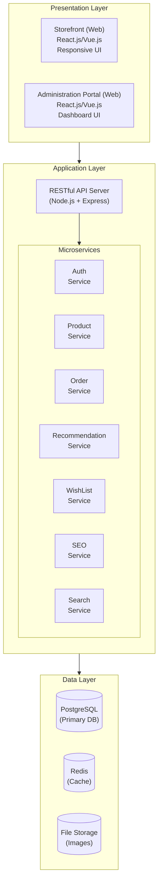
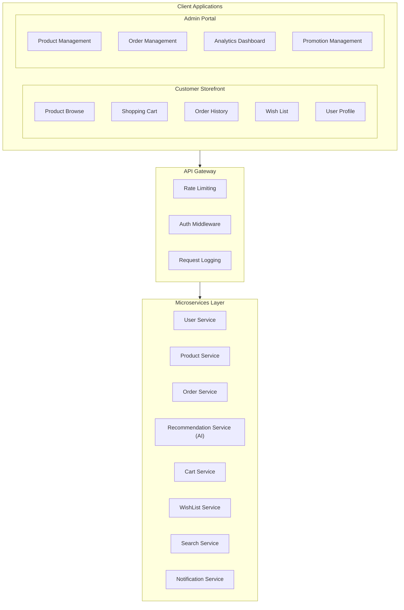
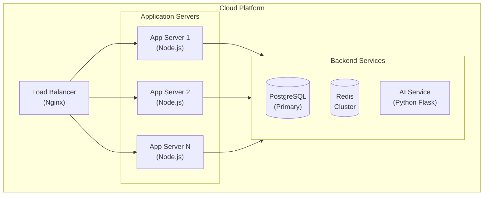
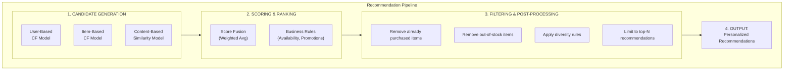

# System Design Document
## Online Shopping System - CSAI3124

---

# 2. System Design

## 2.1 Software Architecture Design

### 2.1.1 Overall Architecture

The Online Shopping System adopts a **three-tier architecture** with clear separation of concerns:



### 2.1.2 Technology Stack

| Layer | Technology | Purpose |
|-------|------------|---------|
| **Frontend** | React.js / Vue.js | SPA framework for responsive UI |
| **Frontend** | Tailwind CSS / Bootstrap | UI component styling |
| **Backend** | Node.js + Express.js | RESTful API server |
| **Backend** | JWT | Authentication & authorization |
| **Database** | PostgreSQL | Primary relational database |
| **Cache** | Redis | Session management, caching |
| **AI/ML** | Python + TensorFlow/Scikit-learn | Recommendation engine |
| **Storage** | AWS S3 / Local Storage | Product images storage |
| **Search** | Elasticsearch (optional) | Full-text search |

### 2.1.3 Component Diagram



### 2.1.4 Deployment Architecture



---

## 2.2 Database Schema Design

### 2.2.1 Entity-Relationship Diagram (Mermaid Code)

```mermaid
erDiagram
    %% User Management
    USER {
        int user_id PK
        varchar email UK
        varchar password_hash
        varchar full_name
        varchar phone
        text shipping_address
        varchar role
        timestamp created_at
        timestamp updated_at
        boolean is_active
    }

    %% Product Management
    CATEGORY {
        int category_id PK
        varchar name
        varchar slug UK
        text description
        int parent_id FK
        int sort_order
        boolean is_active
    }

    PRODUCT {
        int product_id PK
        varchar sku UK
        varchar name
        varchar slug UK
        text short_description
        text description
        decimal price
        decimal sale_price
        int category_id FK
        varchar meta_title
        text meta_description
        varchar meta_keywords
        boolean is_active
        timestamp created_at
        timestamp updated_at
    }

    PRODUCT_IMAGE {
        int image_id PK
        int product_id FK
        varchar image_url
        varchar alt_text
        int sort_order
        boolean is_primary
    }

    PRODUCT_TAG {
        int tag_id PK
        varchar name UK
        varchar slug UK
    }

    PRODUCT_TAG_MAPPING {
        int product_id FK
        int tag_id FK
    }

    PRODUCT_ATTRIBUTE {
        int attribute_id PK
        int product_id FK
        varchar attribute_name
        text attribute_value
        boolean is_html
    }

    %% Shopping Cart
    CART {
        int cart_id PK
        int user_id FK
        timestamp created_at
        timestamp updated_at
    }

    CART_ITEM {
        int cart_item_id PK
        int cart_id FK
        int product_id FK
        int quantity
        timestamp added_at
    }

    %% Order Management
    PURCHASE_ORDER {
        int order_id PK
        varchar order_number UK
        int user_id FK
        decimal total_amount
        varchar status
        text shipping_address
        timestamp order_date
        timestamp shipped_date
        timestamp cancelled_date
        timestamp completed_date
        text notes
    }

    ORDER_ITEM {
        int order_item_id PK
        int order_id FK
        int product_id FK
        varchar product_name
        int quantity
        decimal unit_price
        decimal subtotal
    }

    ORDER_STATUS_HISTORY {
        int history_id PK
        int order_id FK
        varchar old_status
        varchar new_status
        timestamp changed_at
        varchar changed_by
        text notes
    }

    %% Wish List (Block U)
    WISHLIST {
        int wishlist_id PK
        int user_id FK
        timestamp created_at
    }

    WISHLIST_ITEM {
        int wishlist_item_id PK
        int wishlist_id FK
        int product_id FK
        decimal price_when_added
        timestamp added_at
        boolean notified_price_drop
    }

    %% Promotional Pricing (Block U)
    PROMOTION {
        int promotion_id PK
        varchar name
        varchar type
        decimal discount_value
        decimal min_purchase
        date start_date
        date end_date
        boolean is_active
    }

    PRODUCT_PROMOTION {
        int product_id FK
        int promotion_id FK
        decimal promotional_price
    }

    %% AI Recommendation (Block S)
    USER_BEHAVIOR {
        int behavior_id PK
        int user_id FK
        int product_id FK
        varchar action_type
        timestamp action_time
        text session_id
        text metadata
    }

    RECOMMENDATION {
        int recommendation_id PK
        int user_id FK
        int product_id FK
        decimal score
        varchar algorithm_type
        timestamp generated_at
        boolean is_clicked
    }

    %% Price Drop Notification (Block U)
    PRICE_ALERT {
        int alert_id PK
        int user_id FK
        int product_id FK
        decimal target_price
        boolean is_active
        timestamp created_at
        timestamp notified_at
    }

    %% Relationships
    USER ||--o{ CART : has
    USER ||--o{ PURCHASE_ORDER : places
    USER ||--o{ WISHLIST : has
    USER ||--o{ USER_BEHAVIOR : generates
    USER ||--o{ RECOMMENDATION : receives
    USER ||--o{ PRICE_ALERT : sets

    CATEGORY ||--o{ PRODUCT : contains
    CATEGORY ||--o{ CATEGORY : has_subcategory

    PRODUCT ||--o{ PRODUCT_IMAGE : has
    PRODUCT ||--o{ PRODUCT_ATTRIBUTE : has
    PRODUCT ||--o{ CART_ITEM : in
    PRODUCT ||--o{ ORDER_ITEM : in
    PRODUCT ||--o{ WISHLIST_ITEM : in
    PRODUCT ||--o{ USER_BEHAVIOR : tracked
    PRODUCT ||--o{ RECOMMENDATION : recommended
    PRODUCT ||--o{ PRICE_ALERT : monitored
    PRODUCT }o--o{ PRODUCT_TAG : tagged
    PRODUCT }o--o{ PROMOTION : has

    CART ||--o{ CART_ITEM : contains
    WISHLIST ||--o{ WISHLIST_ITEM : contains

    PURCHASE_ORDER ||--o{ ORDER_ITEM : contains
    PURCHASE_ORDER ||--o{ ORDER_STATUS_HISTORY : has

    PRODUCT_TAG ||--o{ PRODUCT_TAG_MAPPING : maps
    PRODUCT ||--o{ PRODUCT_TAG_MAPPING : maps

    PROMOTION ||--o{ PRODUCT_PROMOTION : applies
    PRODUCT ||--o{ PRODUCT_PROMOTION : has
```



### 2.2.2 Database Tables Description

| Table | Description | Related Blocks |
|-------|-------------|----------------|
| `USER` | Customer and admin user accounts | A1, A2 |
| `CATEGORY` | Product categories with hierarchy | C3 |
| `PRODUCT` | Main product information | A3-A6, A14-A18 |
| `PRODUCT_IMAGE` | Multiple images per product | B1 |
| `PRODUCT_TAG` | Tags for filtering products | C3 |
| `PRODUCT_ATTRIBUTE` | Extended product attributes | C1, C5 |
| `CART` | Shopping cart per user | A7-A10 |
| `CART_ITEM` | Items in shopping cart | A7-A10 |
| `PURCHASE_ORDER` | Customer orders | A11-A13, A19-A20 |
| `ORDER_ITEM` | Line items in orders | A13 |
| `ORDER_STATUS_HISTORY` | Order status change tracking | B2, B4 |
| `WISHLIST` | User wish lists | U |
| `WISHLIST_ITEM` | Items in wish list | U |
| `PROMOTION` | Promotional campaigns | U |
| `PRODUCT_PROMOTION` | Product-promotion mapping | U |
| `USER_BEHAVIOR` | User action tracking for AI | S |
| `RECOMMENDATION` | AI-generated recommendations | S |
| `PRICE_ALERT` | Price drop notifications | U |

### 2.2.3 Order Status Workflow (Block B2)

The system implements a 5-status order workflow:

| Status | Description | Transitions From | Transitions To |
|--------|-------------|------------------|----------------|
| `PENDING` | Order just placed | - | CONFIRMED, CANCELLED |
| `CONFIRMED` | Order confirmed by vendor | PENDING | SHIPPED, HOLD |
| `SHIPPED` | Order shipped to customer | CONFIRMED | COMPLETED |
| `COMPLETED` | Order delivered/finished | SHIPPED | - |
| `CANCELLED` | Order cancelled | PENDING, HOLD | - |
| `HOLD` | Order on hold (issues) | CONFIRMED | SHIPPED, CANCELLED |

---

## 2.3 RESTful API Interface Design

### 2.3.1 API Design Principles

- **RESTful conventions**: Use HTTP methods (GET, POST, PUT, DELETE) appropriately
- **JSON format**: All request/response bodies use JSON
- **JWT Authentication**: Bearer token for protected endpoints
- **Versioning**: API versioned via URL prefix (`/api/v1/`)
- **Pagination**: List endpoints support `page` and `limit` parameters
- **Error handling**: Consistent error response format

### 2.3.2 API Endpoints Overview

#### Authentication APIs (Block A1-A2)

| Method | Endpoint | Description | Auth Required |
|--------|----------|-------------|---------------|
| POST | `/api/v1/auth/register` | Register new customer | No |
| POST | `/api/v1/auth/login` | User login | No |
| POST | `/api/v1/auth/logout` | User logout | Yes |
| GET | `/api/v1/auth/profile` | Get user profile | Yes |
| PUT | `/api/v1/auth/profile` | Update user profile | Yes |
| POST | `/api/v1/auth/refresh` | Refresh access token | Yes |

#### Product APIs (Block A3-A6, B1, C1-C5)

| Method | Endpoint | Description | Auth Required |
|--------|----------|-------------|---------------|
| GET | `/api/v1/products` | List products (paginated) | No |
| GET | `/api/v1/products/:id` | Get product detail | No |
| GET | `/api/v1/products/:id/images` | Get product images | No |
| GET | `/api/v1/products/:id/related` | Get related products | No |
| GET | `/api/v1/products/search` | Search products | No |
| GET | `/api/v1/categories` | List all categories | No |
| GET | `/api/v1/categories/:id/products` | Products by category | No |
| GET | `/api/v1/tags` | List all tags | No |

**Query Parameters for Product Search:**
```
GET /api/v1/products/search?
    q=keyword           # Search keyword
    category=1          # Category ID filter
    tags=gaming,laptop  # Tag filter (comma-separated)
    min_price=100       # Minimum price
    max_price=500       # Maximum price
    sort=price_asc      # Sort: price_asc, price_desc, name, newest
    page=1              # Page number
    limit=20            # Items per page
```

#### Shopping Cart APIs (Block A7-A10)

| Method | Endpoint | Description | Auth Required |
|--------|----------|-------------|---------------|
| GET | `/api/v1/cart` | Get cart contents | Yes |
| POST | `/api/v1/cart/items` | Add item to cart | Yes |
| PUT | `/api/v1/cart/items/:id` | Update item quantity | Yes |
| DELETE | `/api/v1/cart/items/:id` | Remove item from cart | Yes |
| DELETE | `/api/v1/cart` | Clear cart | Yes |

#### Order APIs (Block A11-A13, B2-B4)

| Method | Endpoint | Description | Auth Required |
|--------|----------|-------------|---------------|
| POST | `/api/v1/orders` | Create order (checkout) | Yes |
| GET | `/api/v1/orders` | List user orders | Yes |
| GET | `/api/v1/orders/:id` | Get order detail | Yes |
| PUT | `/api/v1/orders/:id/cancel` | Cancel order | Yes |
| GET | `/api/v1/orders/:id/history` | Get status history | Yes |

**Query Parameters for Order List:**
```
GET /api/v1/orders?
    status=PENDING      # Filter by status
    page=1              # Page number
    limit=10            # Items per page
```

#### Wish List APIs (Block U)

| Method | Endpoint | Description | Auth Required |
|--------|----------|-------------|---------------|
| GET | `/api/v1/wishlist` | Get wish list | Yes |
| POST | `/api/v1/wishlist/items` | Add to wish list | Yes |
| DELETE | `/api/v1/wishlist/items/:id` | Remove from wish list | Yes |
| POST | `/api/v1/price-alerts` | Set price alert | Yes |
| GET | `/api/v1/price-alerts` | Get price alerts | Yes |
| DELETE | `/api/v1/price-alerts/:id` | Remove price alert | Yes |

#### Recommendation APIs (Block S)

| Method | Endpoint | Description | Auth Required |
|--------|----------|-------------|---------------|
| GET | `/api/v1/recommendations` | Get personalized recommendations | Yes |
| GET | `/api/v1/recommendations/popular` | Get popular products | No |
| GET | `/api/v1/recommendations/similar/:productId` | Get similar products | No |
| POST | `/api/v1/behaviors` | Track user behavior | Yes |

#### Admin APIs (Block A14-A20)

| Method | Endpoint | Description | Auth Required |
|--------|----------|-------------|---------------|
| GET | `/api/v1/admin/products` | List all products | Admin |
| POST | `/api/v1/admin/products` | Create product | Admin |
| PUT | `/api/v1/admin/products/:id` | Update product | Admin |
| DELETE | `/api/v1/admin/products/:id` | Delete product | Admin |
| PUT | `/api/v1/admin/products/:id/status` | Enable/disable product | Admin |
| POST | `/api/v1/admin/products/:id/images` | Upload product image | Admin |
| DELETE | `/api/v1/admin/products/:id/images/:imageId` | Delete image | Admin |
| GET | `/api/v1/admin/orders` | List all orders | Admin |
| GET | `/api/v1/admin/orders/:id` | Get order detail | Admin |
| PUT | `/api/v1/admin/orders/:id/status` | Update order status | Admin |
| GET | `/api/v1/admin/promotions` | List promotions | Admin |
| POST | `/api/v1/admin/promotions` | Create promotion | Admin |
| PUT | `/api/v1/admin/promotions/:id` | Update promotion | Admin |

### 2.3.3 API Response Format

**Success Response:**
```json
{
    "success": true,
    "data": { ... },
    "meta": {
        "page": 1,
        "limit": 20,
        "total": 100,
        "totalPages": 5
    }
}
```

**Error Response:**
```json
{
    "success": false,
    "error": {
        "code": "VALIDATION_ERROR",
        "message": "Invalid input data",
        "details": [
            { "field": "email", "message": "Email is required" }
        ]
    }
}
```

---

## 2.6 AI Recommendation Architecture Design (Block S)

### 2.6.1 Recommendation System Overview

The AI-powered recommendation system enhances product discovery by analyzing user behaviors and product attributes to provide personalized suggestions.

```
┌─────────────────────────────────────────────────────────────────────┐
│                    AI Recommendation System                          │
├─────────────────────────────────────────────────────────────────────┤
│                                                                      │
│  ┌──────────────────┐    ┌──────────────────┐    ┌───────────────┐  │
│  │  Data Collection │───▶│  Data Processing │───▶│ Model Training│  │
│  │     Layer        │    │     Layer        │    │    Layer      │  │
│  └──────────────────┘    └──────────────────┘    └───────────────┘  │
│           │                       │                      │          │
│           ▼                       ▼                      ▼          │
│  ┌──────────────────┐    ┌──────────────────┐    ┌───────────────┐  │
│  │ User Behaviors   │    │ Feature          │    │ Recommendation│  │
│  │ - Page views     │    │ Engineering      │    │ Models        │  │
│  │ - Cart actions   │    │ - User features  │    │ - CF          │  │
│  │ - Purchases      │    │ - Item features  │    │ - Content     │  │
│  │ - Search queries │    │ - Interaction    │    │ - Hybrid      │  │
│  └──────────────────┘    └──────────────────┘    └───────────────┘  │
│                                                          │          │
│                                                          ▼          │
│                                              ┌───────────────────┐  │
│                                              │ Recommendation    │  │
│                                              │ API Service       │  │
│                                              └───────────────────┘  │
└─────────────────────────────────────────────────────────────────────┘
```

### 2.6.2 Recommendation Strategies

| Strategy | Description | Use Case |
|----------|-------------|----------|
| **Collaborative Filtering** | Recommend based on similar users' preferences | "Users who bought X also bought Y" |
| **Content-Based** | Recommend based on product attributes similarity | Related products on product page |
| **Popularity-Based** | Recommend trending/best-selling products | Homepage, new users |
| **Hybrid** | Combine multiple strategies | Personalized homepage |

### 2.6.3 User Behavior Tracking

**Tracked Events:**

| Event Type | Description | Weight |
|------------|-------------|--------|
| `VIEW` | User views product detail page | 1.0 |
| `ADD_TO_CART` | User adds product to cart | 3.0 |
| `PURCHASE` | User purchases product | 5.0 |
| `WISHLIST_ADD` | User adds to wish list | 2.0 |
| `SEARCH` | User searches for products | 0.5 |
| `CLICK_RECOMMENDATION` | User clicks recommended item | 2.0 |

**Behavior Data Schema:**
```json
{
    "user_id": 123,
    "product_id": 456,
    "action_type": "VIEW",
    "timestamp": "2026-02-01T10:30:00Z",
    "session_id": "abc123",
    "metadata": {
        "source": "search",
        "search_query": "laptop",
        "duration_seconds": 45
    }
}
```

### 2.6.4 Recommendation Algorithm Architecture



### 2.6.5 Technology Stack for AI Service

| Component | Technology | Purpose |
|-----------|------------|---------|
| **ML Framework** | Scikit-learn / TensorFlow | Model training |
| **API Service** | Python Flask / FastAPI | Recommendation API |
| **Feature Store** | Redis | Real-time feature caching |
| **Model Storage** | File System / S3 | Trained model persistence |
| **Batch Processing** | Celery / Cron Jobs | Periodic model retraining |

### 2.6.6 Recommendation API Endpoints

```
GET /api/v1/recommendations
    - Returns personalized recommendations for logged-in user
    - Parameters: limit (default: 10)

GET /api/v1/recommendations/popular
    - Returns popular/trending products
    - Parameters: limit, category_id

GET /api/v1/recommendations/similar/:productId
    - Returns products similar to given product
    - Parameters: limit (default: 6)

POST /api/v1/behaviors
    - Records user behavior for recommendation training
    - Body: { product_id, action_type, metadata }
```

---

## 2.7 SEO Strategy Design (Block Y)

### 2.7.1 SEO Objectives

- Improve search engine visibility for product pages
- Increase organic traffic from search engines
- Enhance click-through rates from search results
- Enable rich snippets in search results

### 2.7.2 SEO-Friendly URL Structure

**URL Design Principles:**
- Use descriptive, keyword-rich URLs
- Use hyphens to separate words
- Keep URLs short and readable
- Include product/category names in URLs

**URL Patterns:**

| Page Type | URL Pattern | Example |
|-----------|-------------|---------|
| Homepage | `/` | `https://shop.com/` |
| Category List | `/category/:slug` | `/category/electronics` |
| Subcategory | `/category/:parent/:child` | `/category/electronics/laptops` |
| Product Detail | `/product/:slug` | `/product/macbook-pro-16-inch` |
| Product by ID | `/p/:id/:slug` | `/p/12345/macbook-pro-16-inch` |
| Search Results | `/search?q=:query` | `/search?q=gaming+laptop` |
| User Orders | `/account/orders` | `/account/orders` |
| Cart | `/cart` | `/cart` |

### 2.7.3 Meta Tags Strategy

**Essential Meta Tags:**

```html
<!-- Basic Meta Tags -->
<title>{Product Name} | {Category} | {Site Name}</title>
<meta name="description" content="{Product short description, 150-160 chars}">
<meta name="keywords" content="{product, category, brand, tags}">
<meta name="robots" content="index, follow">
<link rel="canonical" href="{canonical URL}">

<!-- Open Graph Tags (Facebook, LinkedIn) -->
<meta property="og:title" content="{Product Name}">
<meta property="og:description" content="{Product description}">
<meta property="og:image" content="{Primary product image URL}">
<meta property="og:url" content="{Product page URL}">
<meta property="og:type" content="product">
<meta property="og:site_name" content="{Site Name}">

<!-- Twitter Card Tags -->
<meta name="twitter:card" content="summary_large_image">
<meta name="twitter:title" content="{Product Name}">
<meta name="twitter:description" content="{Product description}">
<meta name="twitter:image" content="{Primary product image URL}">
```

### 2.7.4 Structured Data (JSON-LD)

**Product Schema:**

```json
{
    "@context": "https://schema.org",
    "@type": "Product",
    "name": "MacBook Pro 16-inch",
    "image": [
        "https://shop.com/images/macbook-1.jpg",
        "https://shop.com/images/macbook-2.jpg"
    ],
    "description": "Apple MacBook Pro with M3 chip...",
    "sku": "MBP16-M3-512",
    "brand": {
        "@type": "Brand",
        "name": "Apple"
    },
    "offers": {
        "@type": "Offer",
        "url": "https://shop.com/product/macbook-pro-16-inch",
        "priceCurrency": "HKD",
        "price": "19999",
        "availability": "https://schema.org/InStock",
        "seller": {
            "@type": "Organization",
            "name": "Shop Name"
        }
    },
    "aggregateRating": {
        "@type": "AggregateRating",
        "ratingValue": "4.5",
        "reviewCount": "89"
    }
}
```

**Breadcrumb Schema:**

```json
{
    "@context": "https://schema.org",
    "@type": "BreadcrumbList",
    "itemListElement": [
        {
            "@type": "ListItem",
            "position": 1,
            "name": "Home",
            "item": "https://shop.com/"
        },
        {
            "@type": "ListItem",
            "position": 2,
            "name": "Electronics",
            "item": "https://shop.com/category/electronics"
        },
        {
            "@type": "ListItem",
            "position": 3,
            "name": "Laptops",
            "item": "https://shop.com/category/electronics/laptops"
        },
        {
            "@type": "ListItem",
            "position": 4,
            "name": "MacBook Pro 16-inch"
        }
    ]
}
```

### 2.7.5 Technical SEO Implementation

| Feature | Implementation | Purpose |
|---------|----------------|---------|
| **Sitemap** | Auto-generated XML sitemap at `/sitemap.xml` | Help search engines discover pages |
| **Robots.txt** | Configure at `/robots.txt` | Control crawler access |
| **Canonical URLs** | `<link rel="canonical">` on all pages | Prevent duplicate content |
| **Pagination** | `rel="prev"` and `rel="next"` | Handle paginated content |
| **Mobile-Friendly** | Responsive design | Mobile-first indexing |
| **Page Speed** | Image optimization, lazy loading | Core Web Vitals |
| **HTTPS** | SSL certificate | Security ranking factor |

### 2.7.6 Sitemap Structure

```xml
<?xml version="1.0" encoding="UTF-8"?>
<urlset xmlns="http://www.sitemaps.org/schemas/sitemap/0.9">
    <url>
        <loc>https://shop.com/</loc>
        <lastmod>2026-02-01</lastmod>
        <changefreq>daily</changefreq>
        <priority>1.0</priority>
    </url>
    <url>
        <loc>https://shop.com/category/electronics</loc>
        <lastmod>2026-02-01</lastmod>
        <changefreq>weekly</changefreq>
        <priority>0.8</priority>
    </url>
    <url>
        <loc>https://shop.com/product/macbook-pro-16-inch</loc>
        <lastmod>2026-01-30</lastmod>
        <changefreq>weekly</changefreq>
        <priority>0.6</priority>
    </url>
</urlset>
```

### 2.7.7 SEO Checklist for Development

- [ ] Implement SEO-friendly URL routing
- [ ] Add dynamic meta tags generation
- [ ] Implement Open Graph tags
- [ ] Add JSON-LD structured data for products
- [ ] Generate XML sitemap automatically
- [ ] Configure robots.txt
- [ ] Implement canonical URLs
- [ ] Optimize images (alt text, compression)
- [ ] Ensure mobile responsiveness
- [ ] Implement lazy loading for images
- [ ] Add breadcrumb navigation with schema

---

*Document Version: 1.0*
*Created Date: February 2026*
*Last Updated: February 2026*


